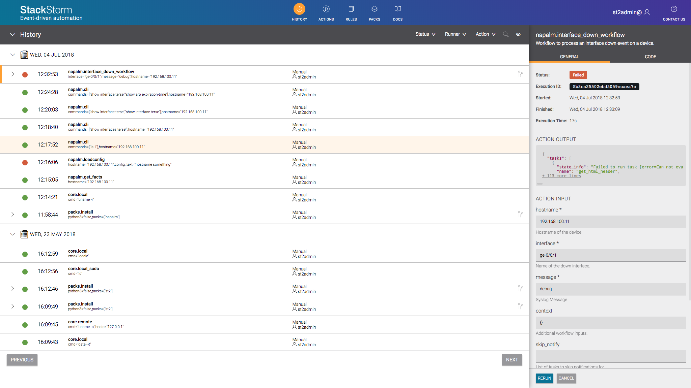

#

## Getting <span style="color:yellow">Started</span>

## Basic ST2 usage

Get into the StackStorm machine
```
vagrant ssh st2
```

ST2 Authentication
```
% export ST2_AUTH_TOKEN=`st2 auth -t -p 'Ch@ngeMe' st2admin`
```

Run a local shell command
```
% st2 run core.local -- uname -r
.
id: 5b3c9dfd02ebd5059ccaea67
status: succeeded
parameters:
  cmd: uname -r
result:
  failed: false
  return_code: 0
  stderr: ''
  stdout: 4.4.0-116-generic
  succeeded: true
```

## Let's use Napalm pack

Install pack (already there):
```
% st2 pack install napalm
```

List Action list
```
% st2 action list --pack=napalm
+--------------------------------------+--------+---------------------------------------------------------------+
| ref                                  | pack   | description                                                   |
+--------------------------------------+--------+---------------------------------------------------------------+
| napalm.bgp_prefix_exceeded_chain     | napalm | Action Chain to process a BGP neighbor prefix limit exceeded  |
|                                      |        | event.                                                        |
| napalm.check_consistency             | napalm | Check that the device's configuration is consistent with the  |
|                                      |        | 'golden' config in a Git repository                           |
| napalm.cli                           | napalm | Run CLI commands on a device using NAPALM.                    |
```

## Configure NAPALM authentication

It's already provided for you in <span style="color:yellow">/opt/stackstorm/configs/napalm.yaml</span>

```
---
html_table_class: napalm

credentials:
  core:
    username: root
    password: Juniper

devices:
- hostname: 192.168.100.11
  driver: junos
  credentials: core
- hostname: 192.168.100.12
  driver: junos
  credentials: core
```

## Apply configuration changes

Every time you change configuration you should reapply it:

```
% st2ctl reload --register-configs

Registering content...[flags = --config-file /etc/st2/st2.conf --register-configs]
2018-06-27 20:21:07,291 INFO [-] Connecting to database "st2" @ "127.0.0.1:27017" as user "stackstorm".
2018-06-27 20:21:07,689 INFO [-] =========================================================
2018-06-27 20:21:07,690 INFO [-] ############## Registering configs ######################
2018-06-27 20:21:07,691 INFO [-] =========================================================
2018-06-27 20:21:07,896 INFO [-] Registered 1 configs.
##### st2 components status #####
st2actionrunner PID: 1101
st2actionrunner PID: 1147
```

## First command, get data

```
% st2 run napalm.get_facts hostname=192.168.100.11
....
id: 5b3c9e2902ebd5059ccaea6a
status: succeeded
parameters:
  hostname: 192.168.100.11
result:
  exit_code: 0
  result:
    raw:
      fqdn: r1
      hostname: r1
      interface_list:
      - ge-0/0/0
      - gr-0/0/0
      - ip-0/0/0
      - lsq-0/0/0
      - lt-0/0/0
      - mt-0/0/0
      - sp-0/0/0
      - ge-0/0/1
      - ge-0/0/2
      - .local.
      - dsc
      - gre
      - ipip
      - irb
      - lo0
      - lsi
      - mtun
      - pimd
      - pime
      - pp0
      - ppd0
      - ppe0
      - st0
      - tap
      - vlan
      model: FIREFLY-PERIMETER
      os_version: 12.1X47-D15.4
      serial_number: 370eb4814607
      uptime: 697
      vendor: Juniper
  stderr: ''
  stdout: ''
```

## Execute commands

```
% st2 run napalm.cli hostname=192.168.100.11 commands="show interface terse","show arp expiration-time"
.
id: 5b3ca05c02ebd5059ccaea79
status: succeeded
parameters:
  commands:
  - show interface terse
  - show arp expiration-time
  hostname: 192.168.100.11
result:
  exit_code: 0
  result:
    raw:
      show arp expiration-time: '
        MAC Address       Address         Name                      Interface           Flags    TTE
        52:54:00:12:35:02 10.0.2.2        10.0.2.2                  ge-0/0/0.0          none 214
        52:54:00:12:35:03 10.0.2.3        10.0.2.3                  ge-0/0/0.0          none 1029
        08:00:27:ef:d4:68 192.168.100.10  192.168.100.10            ge-0/0/1.0          none 342
        08:00:27:2e:44:32 192.168.100.12  192.168.100.12            ge-0/0/1.0          none 422
        Total entries: 4
        '
      show interface terse: "
Interface               Admin Link Proto    Local                 Remote
ge-0/0/0                up    up
ge-0/0/0.0              up    up   inet     10.0.2.15/24
gr-0/0/0                up    up
ip-0/0/0                up    up
lsq-0/0/0               up    up
lt-0/0/0                up    up
mt-0/0/0                up    up
sp-0/0/0                up    up
sp-0/0/0.0              up    up   inet
                                   inet6
sp-0/0/0.16383          up    up   inet     10.0.0.1            --> 10.0.0.16
                                            10.0.0.6            --> 0/0
                                            128.0.0.1           --> 128.0.1.16
                                            128.0.0.6           --> 0/0
ge-0/0/1                up    up
ge-0/0/1.0              up    up   inet     192.168.100.11/24
ge-0/0/2                up    up
dsc                     up    up
gre                     up    up
ipip                    up    up
irb                     up    up
lo0                     up    up
lo0.16384               up    up   inet     127.0.0.1           --> 0/0
lo0.16385               up    up   inet     10.0.0.1            --> 0/0
                                            10.0.0.16           --> 0/0
                                            128.0.0.1           --> 0/0
                                            128.0.0.4           --> 0/0
                                            128.0.1.16          --> 0/0
lo0.32768               up    up
lsi                     up    up
mtun                    up    up
pimd                    up    up
pime                    up    up
pp0                     up    up
ppd0                    up    up
ppe0                    up    up
st0                     up    up
tap                     up    up
vlan                    up    down
"
    raw_array:
      show arp expiration-time:
      - ''
      - MAC Address       Address         Name                      Interface           Flags    TTE
      - 52:54:00:12:35:02 10.0.2.2        10.0.2.2                  ge-0/0/0.0          none 214
      - 52:54:00:12:35:03 10.0.2.3        10.0.2.3                  ge-0/0/0.0          none 1029
      - 08:00:27:ef:d4:68 192.168.100.10  192.168.100.10            ge-0/0/1.0          none 342
      - 08:00:27:2e:44:32 192.168.100.12  192.168.100.12            ge-0/0/1.0          none 422
      - 'Total entries: 4'
      - ''
      show interface terse:
      - ''
      - Interface               Admin Link Proto    Local                 Remote
      - 'ge-0/0/0                up    up  '
      - 'ge-0/0/0.0              up    up   inet     10.0.2.15/24    '
      - 'gr-0/0/0                up    up  '
      - 'ip-0/0/0                up    up  '
      - 'lsq-0/0/0               up    up  '
      - 'lt-0/0/0                up    up  '
      - 'mt-0/0/0                up    up  '
      - 'sp-0/0/0                up    up  '
      - 'sp-0/0/0.0              up    up   inet    '
      - '                                   inet6   '
      - sp-0/0/0.16383          up    up   inet     10.0.0.1            --> 10.0.0.16
      - '                                            10.0.0.6            --> 0/0'
      - '                                            128.0.0.1           --> 128.0.1.16'
      - '                                            128.0.0.6           --> 0/0'
      - 'ge-0/0/1                up    up  '
      - ge-0/0/1.0              up    up   inet     192.168.100.11/24
      - 'ge-0/0/2                up    up  '
      - 'dsc                     up    up  '
      - 'gre                     up    up  '
      - 'ipip                    up    up  '
      - 'irb                     up    up  '
      - 'lo0                     up    up  '
      - lo0.16384               up    up   inet     127.0.0.1           --> 0/0
      - lo0.16385               up    up   inet     10.0.0.1            --> 0/0
      - '                                            10.0.0.16           --> 0/0'
      - '                                            128.0.0.1           --> 0/0'
      - '                                            128.0.0.4           --> 0/0'
      - '                                            128.0.1.16          --> 0/0'
      - 'lo0.32768               up    up  '
      - 'lsi                     up    up  '
      - 'mtun                    up    up  '
      - 'pimd                    up    up  '
      - 'pime                    up    up  '
      - 'pp0                     up    up  '
      - 'ppd0                    up    up  '
      - 'ppe0                    up    up  '
      - 'st0                     up    up  '
      - 'tap                     up    up  '
      - vlan                    up    down
      - ''
  stderr: ''
  stdout: ''
```

## Actions

Build custom actions: [https://docs.stackstorm.com/actions.html](https://docs.stackstorm.com/actions.html)

To register a new action:

* Place it into the content location.
* Tell the system that the action is available.
* The actions are grouped in packs and located at <span style="color:yellow">/opt/stackstorm/packs</span>

## What does an action look like?

```
cat /opt/stackstorm/packs/napalm/actions/cli.py
```

```python
from lib.action import NapalmBaseAction
class NapalmCLI(NapalmBaseAction):
    """Run CLI commands on a network device via NAPALM
    """
    def run(self, commands, **std_kwargs):

        with self.get_driver(**std_kwargs) as device:
            cmds_output = device.cli(commands)
            result = {'raw': cmds_output}
            result_with_pre = {}
            result_as_array = {}
            for this_cmd in cmds_output:
                result_as_array[this_cmd] = cmds_output[this_cmd].split('\n')
                if self.htmlout:
                    result_with_pre[this_cmd] = "<pre>" + cmds_output[this_cmd] + "</pre>"
            result['raw_array'] = result_as_array
            if self.htmlout:
                result['html'] = self.html_out(result_with_pre)
        return (True, result)
```


## Workflow

* Actions, by design, are intended to perfom a single task well
* However, in real world we usually run several discrete tasks and include some decision making along the way -> Workflows
* <span style="color:yellow">Mistral</span> is an OpenStack project that provides (included in ST2):
    * A standarised YAML-based language for defining workflows
    * Open source software for receiving and processing workflows execution requests


## Workflow definition

```
---
version:'2.0'
napalm.interface_down_workflow:
  input:
    - hostname
    - interface
  type: direct
  tasks:
    show_interface:
      action: "napalm.get_interfaces"
      input:
        hostname: "{{ _.hostname }}"
        interface: "{{ _interface}}"
      on-success: "show_interface_counters"
    show_interface_counters:
      action: "napalm.get_interfaces"
      input:
        hostname: "{{ _.hostname }}"
        interface: "{{ _interface}}"
        counters: true
      on-success: "show_log"
    show_log:
      action: "napalm.get_log"
      input:
        hostname: "{{ _.hostname }}"
        lastlines: 10
```

## Workflow exectution

```
% st2 run napalm.interface_down_workflow hostname=192.168.100.11 interface=ge-0/0/1 message=debug
........
id: 5b3ca25502ebd5059ccaea7c
action.ref: napalm.interface_down_workflow
parameters:
  hostname: 192.168.100.11
  interface: ge-0/0/1
  message: debug
status: failed
result_task: show_log
result:
  exit_code: 0
  result:
    html: '<pre>Jul  4 10:33:07  r1 file[2345]: UI_CHILD_WAITPID: waitpid failed: PID 0, rc 2347, status 0: Message too long
Jul  4 10:33:07  r1 PERF_MON: RTPERF_CPU_THRESHOLD_EXCEEDED: FPC 0 PIC 0 CPU utilization exceeds threshold, current value=95
Jul  4 10:33:07  r1 file[2345]: UI_CMDLINE_READ_LINE: User ''root'', command ''command rpc rpc command set cli screen-length 0 ''
Jul  4 10:33:07  r1 file[2345]: UI_NETCONF_CMD: User ''root'' used NETCONF client to run command ''set cli screen-length length=0''
Jul  4 10:33:07  r1 file[2348]: UI_CHILD_START: Starting child ''/usr/sbin/cli''
Jul  4 10:33:07  r1 file[2345]: UI_CHILD_STATUS: Cleanup child ''/usr/sbin/cli'', PID 0, status 0
Jul  4 10:33:07  r1 file[2345]: UI_CHILD_WAITPID: waitpid failed: PID 0, rc 2348, status 0: Unknown error: 0
Jul  4 10:33:07  r1 file[2345]: UI_CMDLINE_READ_LINE: User ''root'', command ''command rpc rpc command show log messages ''
Jul  4 10:33:07  r1 file[2345]: UI_NETCONF_CMD: User ''root'' used NETCONF client to run command ''get-log filename=messages''
Jul  4 10:33:07  r1 file[2349]: UI_CHILD_START: Starting child ''/usr/sbin/cli''</pre>'
    raw:
    - 'Jul  4 10:33:07  r1 file[2345]: UI_CHILD_WAITPID: waitpid failed: PID 0, rc 2347, status 0: Message too long'
    - 'Jul  4 10:33:07  r1 PERF_MON: RTPERF_CPU_THRESHOLD_EXCEEDED: FPC 0 PIC 0 CPU utilization exceeds threshold, current value=95'
    - 'Jul  4 10:33:07  r1 file[2345]: UI_CMDLINE_READ_LINE: User ''root'', command ''command rpc rpc command set cli screen-length 0 '''
    - 'Jul  4 10:33:07  r1 file[2345]: UI_NETCONF_CMD: User ''root'' used NETCONF client to run command ''set cli screen-length length=0'''
    - 'Jul  4 10:33:07  r1 file[2348]: UI_CHILD_START: Starting child ''/usr/sbin/cli'''
    - 'Jul  4 10:33:07  r1 file[2345]: UI_CHILD_STATUS: Cleanup child ''/usr/sbin/cli'', PID 0, status 0'
    - 'Jul  4 10:33:07  r1 file[2345]: UI_CHILD_WAITPID: waitpid failed: PID 0, rc 2348, status 0: Unknown error: 0'
    - 'Jul  4 10:33:07  r1 file[2345]: UI_CMDLINE_READ_LINE: User ''root'', command ''command rpc rpc command show log messages '''
    - 'Jul  4 10:33:07  r1 file[2345]: UI_NETCONF_CMD: User ''root'' used NETCONF client to run command ''get-log filename=messages'''
    - 'Jul  4 10:33:07  r1 file[2349]: UI_CHILD_START: Starting child ''/usr/sbin/cli'''
  stderr: ''
  stdout: ''
start_timestamp: Wed, 04 Jul 2018 10:32:53 UTC
end_timestamp: Wed, 04 Jul 2018 10:33:09 UTC
```

##

```
+--------------------------+------------------------+-------------------------+-----------------------+-------------------------------+
| id                       | status                 | task                    | action                | start_timestamp               |
+--------------------------+------------------------+-------------------------+-----------------------+-------------------------------+
| 5b3ca25602ebd5059ccaea7f | succeeded (4s elapsed) | show_interface          | napalm.get_interfaces | Wed, 04 Jul 2018 10:32:54 UTC |
| 5b3ca25a02ebd5059ccaea81 | succeeded (5s elapsed) | show_interface_counters | napalm.get_interfaces | Wed, 04 Jul 2018 10:32:58 UTC |
| 5b3ca25f02ebd5059ccaea83 | succeeded (6s elapsed) | show_log                | napalm.get_log        | Wed, 04 Jul 2018 10:33:03 UTC |
+--------------------------+------------------------+-------------------------+-----------------------+-------------------------------+
```

##

```
% st2 execution get 5b3ca25602ebd5059ccaea7f
id: 5b3ca25602ebd5059ccaea7f
status: succeeded (4s elapsed)
parameters:
  hostname: 192.168.100.11
  htmlout: true
  interface: ge-0/0/1
result:
  exit_code: 0
  result:
    html: <table class="napalm"><tr><th>is_enabled</th><td>True</td></tr><tr><th>description</th><td></td></tr><tr><th>last_flapped</th><td>1698.0</td></tr><tr><th>is_up</th><td>True</td></tr><tr><th>mac_address</th><td>08:00:27:47:0B:31</td></tr><tr><th>speed</th><td>1000</td></tr><tr><th>name</th><td>ge-0/0/1</td></tr></table>
    raw:
      description: ''
      is_enabled: true
      is_up: true
      last_flapped: 1698.0
      mac_address: 08:00:27:47:0B:31
      name: ge-0/0/1
      speed: 1000
  stderr: ''
  stdout: ''
```

##

```
% st2 execution get 5b3ca25a02ebd5059ccaea81
id: 5b3ca25a02ebd5059ccaea81
status: succeeded (5s elapsed)
parameters:
  counters: true
  hostname: 192.168.100.11
  htmlout: true
  interface: ge-0/0/1
result:
  exit_code: 0
  result:
    html: <table class="napalm"><tr><th>tx_multicast_packets</th><td>0</td></tr><tr><th>tx_discards</th><td>0</td></tr><tr><th>tx_octets</th><td>17180951</td></tr><tr><th>tx_errors</th><td>0</td></tr><tr><th>rx_octets</th><td>29669628</td></tr><tr><th>tx_unicast_packets</th><td>158297</td></tr><tr><th>rx_errors</th><td>0</td></tr><tr><th>tx_broadcast_packets</th><td>0</td></tr><tr><th>rx_multicast_packets</th><td>0</td></tr><tr><th>rx_broadcast_packets</th><td>0</td></tr><tr><th>rx_discards</th><td>0</td></tr><tr><th>rx_unicast_packets</th><td>430419</td></tr><tr><th>name</th><td>ge-0/0/1</td></tr></table>
    raw:
      name: ge-0/0/1
      rx_broadcast_packets: 0
      rx_discards: 0
      rx_errors: 0
      rx_multicast_packets: 0
      rx_octets: 29669628
      rx_unicast_packets: 430419
      tx_broadcast_packets: 0
      tx_discards: 0
      tx_errors: 0
      tx_multicast_packets: 0
      tx_octets: 17180951
      tx_unicast_packets: 158297
  stderr: ''
  stdout: ''
```

## Sensors and Triggers

* Sensors -> Pull
* Triggers -> Push (webhooks)

```
st2 sensor list --pack napalm
+-----------------------+--------+-----------------------+---------+
| ref                   | pack   | description           | enabled |
+-----------------------+--------+-----------------------+---------+
| napalm.NapalmLLDPSens | napalm | Sensor that uses      | False   |
| or                    |        | NAPALM to retrieve    |         |
|                       |        | LLDP information from |         |
|                       |        | network devices       |         |
+-----------------------+--------+-----------------------+---------+

st2 trigger list --pack napalm
+-----------------------------+--------+------------------------------+
| ref                         | pack   | description                  |
+-----------------------------+--------+------------------------------+
| napalm.LLDPNeighborDecrease | napalm | Trigger which occurs when a  |
|                             |        | device's LLDP neighbors      |
|                             |        | decrease                     |
+-----------------------------+--------+------------------------------+

```

##

```
% st2 sensor enable napalm.NapalmLLDPSensor

+---------------+--------------------------------------------------------------+
| Property      | Value                                                        |
+---------------+--------------------------------------------------------------+
| id            | 5b39c90d02ebd507dacc6a42                                     |
| name          | NapalmLLDPSensor                                             |
| pack          | napalm                                                       |
| description   | Sensor that uses NAPALM to retrieve LLDP information from    |
|               | network devices                                              |
| artifact_uri  | file:///opt/stackstorm/packs/napalm/sensors/lldp_sensor.py   |
| enabled       | True                                                         |
| entry_point   | sensors.lldp_sensor.NapalmLLDPSensor                         |
| ref           | napalm.NapalmLLDPSensor                                      |
| trigger_types | [                                                            |
|               |     "napalm.LLDPNeighborDecrease",                           |
|               |     "napalm.LLDPNeighborDecrease"                            |
|               | ]                                                            |
| uid           | sensor_type:napalm:NapalmLLDPSensor                          |
+---------------+--------------------------------------------------------------+
```
```
tail -f /var/log/st2/st2sensorcontainer.log
```

## Rules

Rules is the key part of ST2, it brings together actions and sensors and triggers to create event driven automation.

[https://docs.stackstorm.com/rules.html](https://docs.stackstorm.com/rules.html)

```
% st2 rule list

+-----------------------+---------+-----------------------+---------+
| ref                   | pack    | description           | enabled |
+-----------------------+---------+-----------------------+---------+
| chatops.notify        | chatops | Notification rule to  | True    |
|                       |         | send results of       |         |
|                       |         | action executions to  |         |
|                       |         | stream for chatops    |         |
| napalm.bgp_prefix_exc | napalm  | Webhook which handles | True    |
| eeded                 |         | a BGP neighbor        |         |
|                       |         | exceeding it's prefix |         |
|                       |         | limit                 |         |
| napalm.configuration_ | napalm  | Webhook which handles | True    |
| change                |         | when a device has     |         |
|                       |         | been configured and   |         |
|                       |         | changes commited      |         |
| napalm.interface_down | napalm  | Webhook which handles | True    |
|                       |         | an interface going    |         |
|                       |         | down on a network     |         |
|                       |         | device.               |         |
| napalm.lldp_remediate | napalm  | Demonstrate simple    | True    |
|                       |         | auto-remediation      |         |
|                       |         | event                 |         |
+-----------------------+---------+-----------------------+---------+

```

##

```
---
name: "lldp_notify"
pack: "napalm"
enabled: true
description: "Notify of LLDP Neighbor Decrease"

trigger:
  type: "napalm.LLDPNeighborDecrease"
  parametres: {}

criteria: {}

action:
  ref: slack.post_message
  parameters:
    message: "WARNING: {{trigger.device}}'s LLDP Neighbors just went DOWN to {{trigger.newpeers}} (was {{trigger.oldpeers}})"
    channel: '#general'
```

## Managing rules

* To deploy a rule, use the CLI command: <span style="color:yellow">st2 rule create ${PATH_TO_RULE}</span>,
    * <span style="color:yellow">st2 rule create</span>
* To reload all the rules, use <span style="color:yellow">st2ctl reload --register-rules</span>
* Custom rules can be placed in any accessible folder on local system. By convention, custom rules are placed in the /opt/stackstorm/packs/<pack_name>/rules directory.
* To make testing rules easier we provide a <span style="color:yellow">st2-rule-tester</span> tool which can evaluate rules against trigger instances without running any of the StackStorm components.

## ST2 web interface


